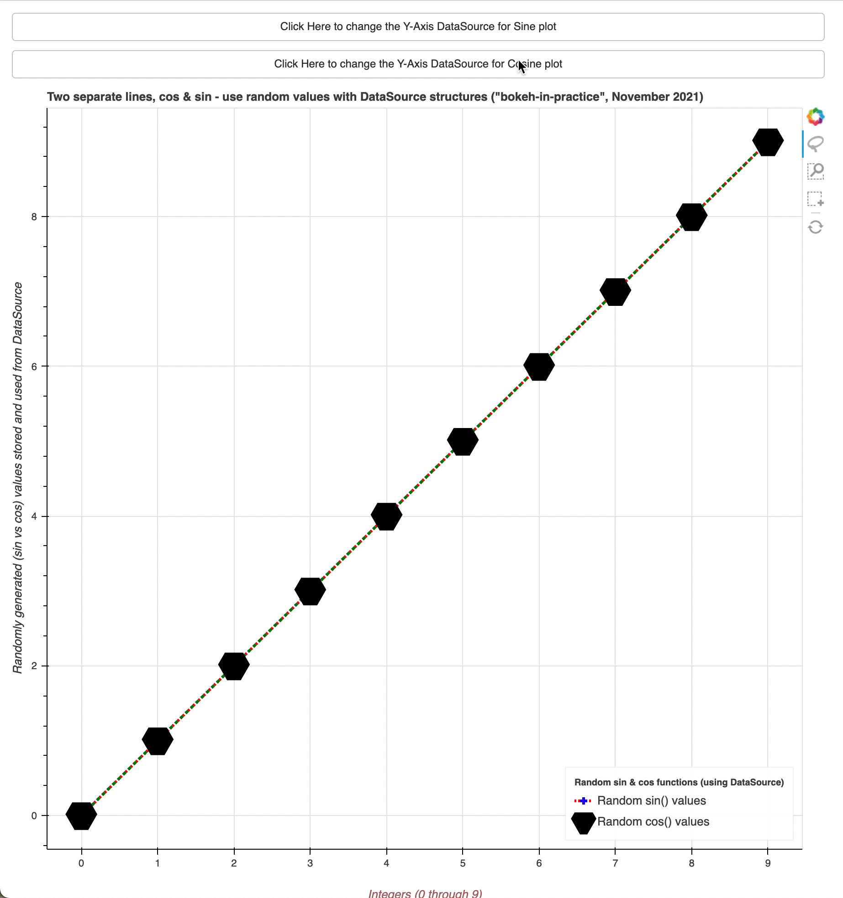

# bokeh-in-practice

Collection of scripts & recipes demonstrating usual || not so usual usage of Bokeh library

## Main Purpose

* We would like to present the user with more clear and step-by-step strategy when building awesome Bokeh
  graphs/dashboards/applications
* This guide aims at supplementing the
  official [Bokeh user guide](https://docs.bokeh.org/en/latest/docs/user_guide.html)
  available online, rather than at replacing it
* We hope that the user finds it useful as a reference of Bokeh recipes

## What you will learn

* You'll learn to build step-by-step plots
* Examples start from simple ones to gradually becoming more complex/interesting

## See examples of:

### Plot Lines & Curves (from simple/basic examples to well documented and annotated curves and plots)

  <table>
  <tr>
    <td> </td>
    <td></td>
    <td></td>
  </tr>
  <tr>
    <td> </td>
    <td></td>
    <td></td>
  </tr>
  </table>

### Fetch Data from different sources (preprocessed CSV files, directly from the web, etc)

  <table>
  <tr>
    <td></td>
  </tr>
  </table>

### Acknowledgements

* The author of this repository has no relationship whatsoever with the Bokeh product; he just enjoyed working with it
  so much so that he decided to provide some easier to follow ways of working, compared to what he found online, on his
  first experience with Bokeh
* The WIP gif was found as publicly available,
  at [tenor.com](https://tenor.com/view/work-work-in-progress-wip-hurray-design-in-progress-gif-18632420)

## [License](https://github.com/vBarbaros/bokeh-in-practice/blob/main/LICENSE)

MIT © [Victor Barbaros, 2021](https://github.com/vBarbaros)

