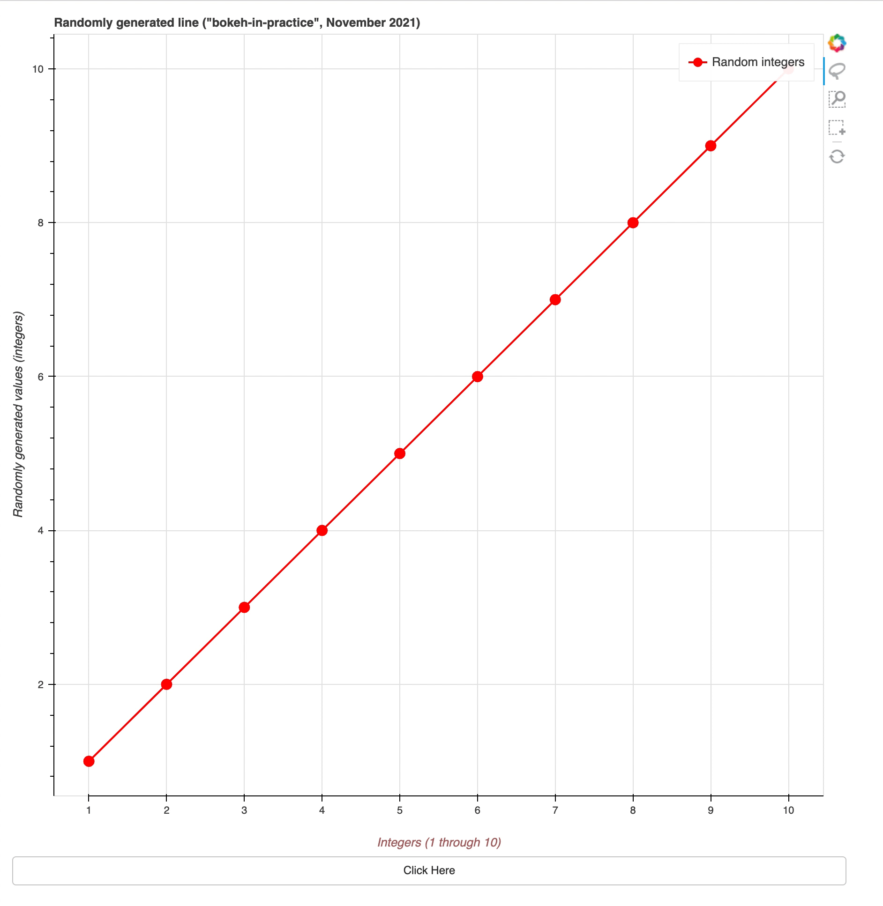

### Well-Documented Line Example
step 1 - import all you need
```
from random import random

from bokeh.layouts import column
from bokeh.plotting import figure, curdoc
from bokeh.models import Button, FixedTicker
```

step 2 - instantiate the `datasource` (in this simple case, use the same array for both X & Y axis)
```
X_AXIS = Y_AXIS = [1, 2, 3, 4, 5, 6, 7, 8, 9, 10]`
```

step 3 - define a `figure` object with the following parameters:
- a meaningful `title`,
- a set of `tools` to be displayed (to be eventually used on the generated plot)
- size (`width`, `height`)
```
main_plot = figure(title='Randomly generated line ("bokeh-in-practice", November 2021)',
                   tools="box_select,box_zoom,lasso_select,reset",
                   width=900, height=900)
```

step 4 - customize the `X-axis` by defining:
- the `X-axis` `label` and  `color`
- relative position (`standoff`) from the plot margin
- `X-axis` `bounds` (1 to 10)
- some nice `ticker`, to emphasize the 1 to 10 range
```
main_plot.xaxis.axis_label = "Integers (1 through 10)"
main_plot.xaxis.axis_label_text_color = "#aa6666"
main_plot.xaxis.axis_label_standoff = 20
main_plot.xaxis.bounds = (1, 10)
main_plot.xaxis.ticker = FixedTicker(ticks=X_AXIS)
```

step 5 - customize the `Y-axis` by defining:
- the `Y-axis` label and text style
```
main_plot.yaxis.axis_label = "Randomly generated values (integers)"
main_plot.yaxis.axis_label_text_font_style = "italic"
```

step 6 - define two elements, a `line` and a `circle` in your figure, and specify:
- the `x` and `y` values
- the line `width` and `color`,
- additionally, define the `legend_label` parameter and ensure it has the same value for circle and line elements
  - this is important to do since we'll use the same data source for both of these elements
  and they will superpose each other in the plot in a nice way while showing a nice legend as well,
  to make your plot more readable;
```
main_line = main_plot.line(x=X_AXIS, y=Y_AXIS, line_width=2, color='red', legend_label='Random integers')
main_circle = main_plot.circle(x=X_AXIS, y=Y_AXIS, line_width=2, color='red', legend_label='Random integers', size=10)
```

step 7 - define a variable that references your `data_source` for each of the defined elemets, `main_line` and `main_circle`
- this gives you the possibility to change the `data` interactively from your dashboard, for each of the elements in your plot
```
data_source_line = main_line.data_source
data_source_circle = main_circle.data_source
```

step 8 - define a `handler` function that will be called on an event and define your changes
of the `data`, as you wish:
- here, we chose to keep the `X-axis` values the same as initially defined
- the `Y-axis` values will be generated randomly
  - NOTE: the same `Y-axis` values will be used for both, the `data_source_line` and `data_source_circle` elements, in our plot 
```
def handler_main_plot(event):
    new_data = dict()
    new_data['x'] = X_AXIS
    new_data['y'] = [random() for i in range(10)]
    data_source_line.data = new_data
    data_source_circle.data = new_data
```

step 9 - add a `button` widget and set the `handler` to be called on each click
```
button = Button(label="Click Here")
button.on_click(handler_main_plot)
```

step 10 - configure the `root` elements in the `Document` object
```
curdoc().add_root(column(main_plot, button))
```

step 11 - run the following command from terminal
- it should open a browser at `http://localhost:5006/bokeh_well_documented_line`
```
$ cd src/lines/
$ bokeh serve bokeh_well_documented_line.py --show
```

step 12 - enjoy it!
