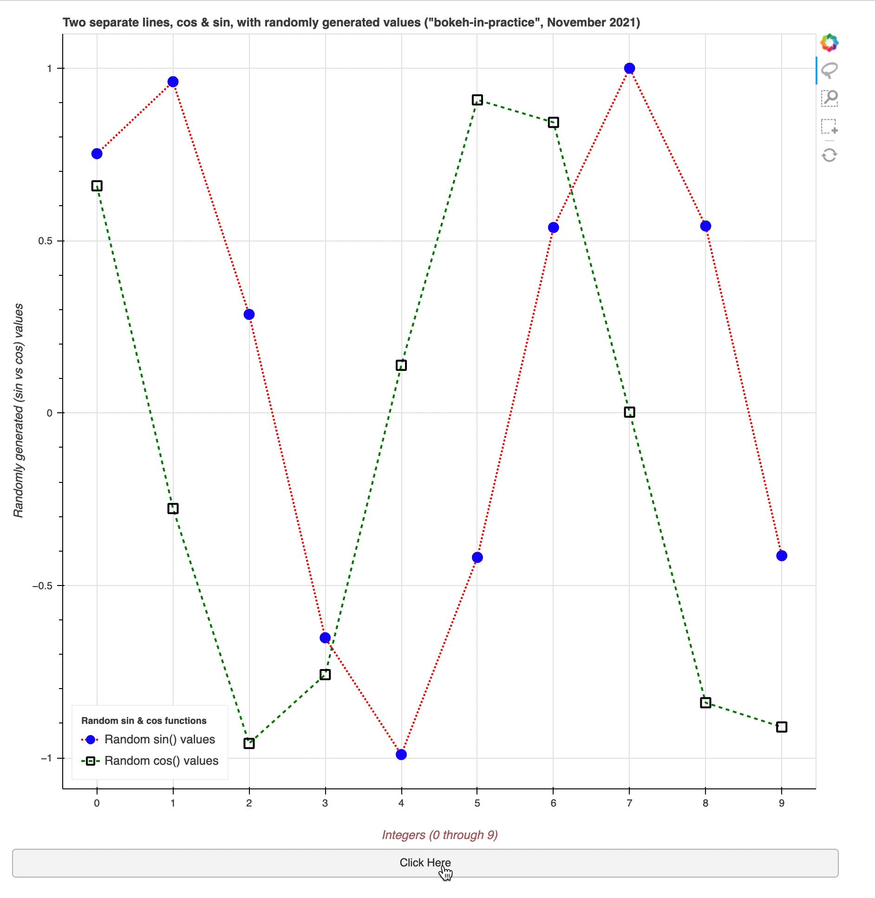

### (c) Sine & Cosine lines Lines Example
step 1 - import all you need
```
import math
from random import random

from bokeh.layouts import column
from bokeh.plotting import figure, curdoc
from bokeh.models import Button, FixedTicker
```

step 2 - instantiate the `datasource` (in this simple case, use the same array for both X & Y axis)
- since we plan to use sin & cos values, we would display the plot in the domain of [0, 9]
```
X_AXIS = Y_AXIS = [0, 1, 2, 3, 4, 5, 6, 7, 8, 9]
```

step 3 - define a `figure` object with the following parameters:
- a meaningful `title`,
- a set of `tools` to be displayed (to be eventually used on the generated plot)
- size (`width`, `height`)
```
main_plot = figure(
    title='Two separate lines, cos & sin, with randomly generated values ("bokeh-in-practice", November 2021)',
    tools="box_select,box_zoom,lasso_select,reset",
    width=900, height=900)
```

step 4 - customize the `X-axis` by defining:
- the `X-axis` `label` and  `color`
- relative position (`standoff`) from the plot margin
- `X-axis` `bounds` (1 to 10)
- some nice `ticker`, to emphasize the 1 to 10 range
```
main_plot.xaxis.axis_label = "Integers (0 through 9)"
main_plot.xaxis.axis_label_text_color = "#aa6666"
main_plot.xaxis.axis_label_standoff = 20
main_plot.xaxis.bounds = (-1, 10)
main_plot.xaxis.ticker = FixedTicker(ticks=X_AXIS)
```

step 5 - customize the `Y-axis` by defining:
- the `Y-axis` `label` and `text style`
```
main_plot.yaxis.axis_label = "Randomly generated (sin vs cos) values"
main_plot.yaxis.axis_label_text_font_style = "italic"
```

step 6 - define two elements for each of the sine and cosine graphs that we are about to plot.
- For the `sine` function we'll define a `line` and a `circle` in our figure, and specify:
  - the `x` and `y` values
  - the line `width` and `color`,
  - the `line_dash` with proper intervals, for `line` part,
  - the color of the `circle` part,
  - additionally, define the `legend_label` parameter and ensure it has the same value for circle and line elements
```
main_line_sin = main_plot.line(x=X_AXIS, y=Y_AXIS, line_width=2, color='red', line_dash=[2, 2],
                               legend_label='Random sin() values')
main_circle_sin = main_plot.circle(x=X_AXIS, y=Y_AXIS, line_width=2, color='blue', legend_label='Random sin() values',
                                   size=10)
```

- For the `cosine` function we'll define a `line` and a `square` in our figure, and specify:
  - the `x` and `y` values
  - the line `width` and `color`,
  - the `line_dash` with proper intervals, for `line` part,
  - the color of the `square` part (no color in this case),
  - additionally, define the `legend_label` parameter and ensure it has the same value for square and line elements
```
main_line_cos = main_plot.line(x=X_AXIS, y=Y_AXIS, line_width=2, color='green', line_dash=[4, 4],
                               legend_label='Random cos() values')
main_square_cos = main_plot.square(x=X_AXIS, y=Y_AXIS, line_width=2, color='black', fill_color=None,
                                   legend_label='Random cos() values', size=10)
```

step 7 - once we completed the definition of each line, circle and square, let's modify a bit the default
parameters for the displayed legend
```
main_plot.legend.location = "bottom_left"
main_plot.legend.title = 'Random sin & cos functions'
main_plot.legend.title_text_font_style = "bold"
main_plot.legend.title_text_font_size = "10px"
```


step 8 - define the appropriate variables to reference the `data_source` for each of the defined elements: 
`main_line_sin`, `main_circle_sin`, `main_line_cos` and `main_square_cos`
- this gives you the possibility to change the `data` interactively from our dashboard, 
for each of the elements in our plot
```
data_source_line_sin = main_line_sin.data_source
data_source_circle_sin = main_circle_sin.data_source

data_source_line_cos = main_line_cos.data_source
data_source_square_cos = main_square_cos.data_source
```

step 9 - define a `handler` function that will be called on an event and define our changes
of the `data`, as you wish:
- here, we chose to keep the `X-axis` values the same as initially defined
- the `Y-axis` values will be generated randomly
  - NOTE: the same random seed, `seed_int`, will be used to generate each of the lists used further for the `sin` 
  and `cos` plots
```
def handler_main_plot(event):
    seed_int = random()
    new_data_sine = dict()
    new_data_sine['x'] = X_AXIS
    new_data_sine['y'] = [math.sin(i + seed_int) for i in range(10)]
    data_source_line_sin.data = new_data_sine
    data_source_circle_sin.data = new_data_sine

    new_data_cos = dict()
    new_data_cos['x'] = X_AXIS
    new_data_cos['y'] = [math.cos(i + seed_int) for i in range(0, 10)]
    data_source_line_cos.data = new_data_cos
    data_source_square_cos.data = new_data_cos
```

step 10 - add a `button` widget and set the `handler` to be called on each click
```
button = Button(label="Click Here")
button.on_click(handler_main_plot)
```

step 11 - configure the `root` elements in the `Document` object
```
curdoc().add_root(column(main_plot, button))
```

step 12 - run the following command from terminal
- it should open a browser at `http://localhost:5006/bokeh_well_documented_line`
```
$ cd src/lines/
$ bokeh serve bokeh_well_documented_line.py --show
```

step 13 - enjoy it!
