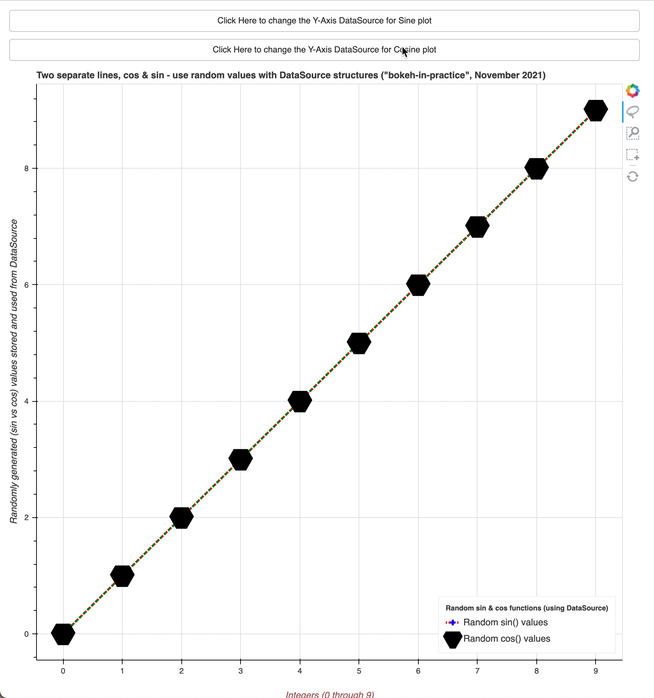

### (e) Sine & Cosine lines Lines Example - Use ColumnDataSource Objects for simpler code
step 1 - import all you need
```
import math
from random import random

from bokeh.layouts import column
from bokeh.plotting import figure, curdoc
from bokeh.models import Button, FixedTicker, ColumnDataSource
```

step 2 - instantiate the initial values for the `datasource`
```
X_AXIS = Y_AXIS = [0, 1, 2, 3, 4, 5, 6, 7, 8, 9]
```

step 3 - describe the `figure` object by putting the right `title`, `tools` and `size`params
```
main_plot = figure(
    title='Two separate lines, cos & sin - use random values with DataSource structures ("bokeh-in-practice", November 2021)',
    tools="box_select,box_zoom,lasso_select,reset",
    width=900, height=900)
```

step 4 - customize both, `X` and `Y` axes
```
main_plot.xaxis.axis_label = "Integers (0 through 9)"
main_plot.xaxis.axis_label_text_color = "#aa6666"
main_plot.xaxis.axis_label_standoff = 20
main_plot.xaxis.bounds = (-1, 10)
main_plot.xaxis.ticker = FixedTicker(ticks=X_AXIS)

main_plot.yaxis.axis_label = "Randomly generated (sin vs cos) values stored and used from DataSource"
main_plot.yaxis.axis_label_text_font_style = "italic"
```

step 5 - (NEW from previous models) define two `ColumnDataSource` objects, which will control separately, the Sine and Cosine functions data
```
DATA_SOURCE_SINE = ColumnDataSource(data=dict(x_sin=X_AXIS, y_sin=Y_AXIS))

DATA_SOURCE_COSINE = ColumnDataSource(data=dict(x_cos=X_AXIS, y_cos=Y_AXIS))
```

step 6 - define two elements for each of the sine and cosine graphs that we are about to plot.
- For the `sine` function we'll define a `line` and a `cross` in our figure, and specify:
  - (NEW from previous models) the `x` and `y` values, as well as `source`, which will use the new way of 
  injecting our data for the `sine` function
  - the line `width` and `color`,
  - the `line_dash` with proper intervals, for `line` part,
  - the color of the `cross` part,
  - additionally, define the `legend_label` parameter and ensure it has the same value for circle and line elements
```
main_line_sin = main_plot.line(x="x_sin", y="y_sin", source=DATA_SOURCE_SINE, line_width=3, color='red',
                               line_dash=[2, 2],
                               legend_label='Random sin() values')
main_circle_sin = main_plot.cross(x="x_sin", y="y_sin", source=DATA_SOURCE_SINE, line_width=3, color='blue',
                                   legend_label='Random sin() values',
                                   size=15)
```

- For the `cosine` function we'll define a `line` and a `triangle` in our figure, and specify:
  - (NEW from previous models) the `x` and `y` values, as well as `source`, which will use the new way of 
  injecting our data for the `cosine` function
  - the line `width` and `color`,
  - the `line_dash` with proper intervals, for `line` part,
  - the color of the `triangle` part (no color in this case),
  - additionally, define the `legend_label` parameter and ensure it has the same value for square and line elements
```
main_line_cos = main_plot.line(x="x_cos", y="y_cos", source=DATA_SOURCE_COSINE, line_width=3, color='green',
                               line_dash=[4, 4],
                               legend_label='Random cos() values')
main_square_cos = main_plot.triangle(x="x_cos", y="y_cos", source=DATA_SOURCE_COSINE, line_width=23, color='black',
                                   fill_color=None,
                                   legend_label='Random cos() values', size=15)
```

step 7 - once we completed the definition of each line, circle and square, let's modify a bit the default
parameters for the displayed legend
```
main_plot.legend.location = "bottom_left"
main_plot.legend.title = 'Random sin & cos functions'
main_plot.legend.title_text_font_style = "bold"
main_plot.legend.title_text_font_size = "10px"
```

#### Now, we don't need individual reference objects for each of the `data sources` for each element in our figure, and the `handler` functions become much more simple (see below)
step 8 - (NEW from previous models) define a `handler` function for each plot - it will be called on an event and define our changes
of the `data`:
- define the handler for the `sine` functions/plot
```
def handler_sine_plot(event):
    seed_int = random()
    DATA_SOURCE_SINE.data['y_sin'] = [math.sin(i + seed_int) for i in range(10)]
```

- define the handler for the `cosine` functions/plot
```
def handler_cosine_plot(event):
    seed_int = random()
    DATA_SOURCE_COSINE.data['y_cos'] = [math.cos(i + seed_int) for i in range(10)]
```

step 9 - add two `Button` widgets and set the appropriate `handler` for each, to be called on a click event
```
sine_button = Button(label="Click Here to change Sine plot")
sine_button.on_click(handler_sine_plot)

cosine_button = Button(label="Click Here to change Cosine plot")
cosine_button.on_click(handler_cosine_plot)
```

step 10 - (NEW from previous models) configure the `root` elements in the `Document` object
- note that we now have three elements to be added to the root: `main_plot`, `sine_button`, and `cosine_button`
```
curdoc().add_root(column(sine_button, cosine_button, main_plot))
```

step 11 - run the following command from the terminal
- it should open a browser at `http://localhost:5006/bokeh_well_documented_line`
```
$ cd src/lines/
$ bokeh serve e_bokeh_two_lines_data_source.py --show
```

step 12 - enjoy it!
